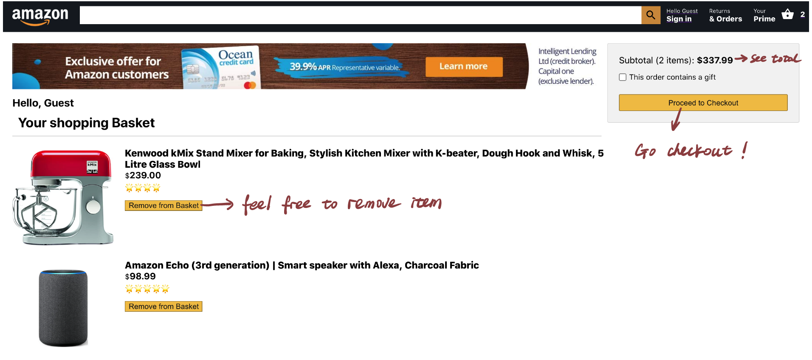

# Amazon-client

Live Deployment

[https://amazon-client.cmgrace.vercel.app/](https://amazon-client.cmgrace.vercel.app/)

## Main feature

- User can add/remove items to the cart
- User can view the items in cart
- User can checkout only after login, authenticated user info refer to link "Get to know us" (at bottom)
- User can place order

## Technology used

### Frontend

- ReactJS
- React Router
- React Context
- HTML
- CSS
- Webpack
- Jest
- Deployed at Vercel

### Backend

- RESTful API
- Node & Express
- PostgresSQL
- Knex
- Supertest
- Mocha & Chai
- Deployed Heroku
